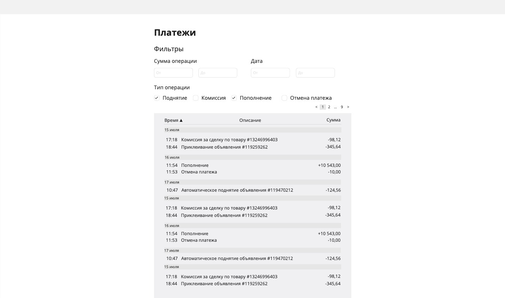
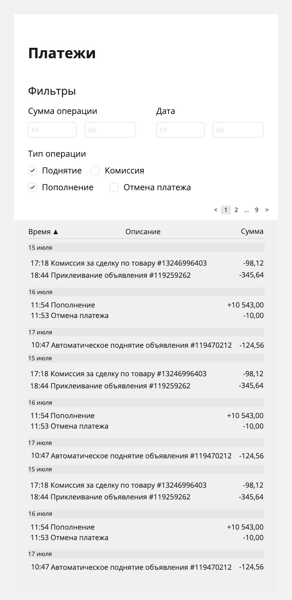

# Тестовое задание кандидата на практику FarPost 2025

## Требования к стеку

- ✅ React (Обязательно, другие библиотеки и фреймворки не принимаем)
- ✅ Tailwind (По желанию, но будет плюсом если стили будут написаны самостоятельно, sass, scss приветствуются)
- ❌ TypeScript
- ❌ Стейт менеджеры (redux, mobx, zustand и прочее)
- ❌ Библиотеки компонентов (antd, materialui, shadcnui и т.д.)

## Что нужно сделать

Нужно будет создать страницу детализации счета, где можно просмотреть все оперции по лицевому счету.  
На странице должна быть таблица в которой отображено: **время**, **описание** и **сумма операции**, строки в таблице сгруппированны по дням.  
Помимо этого у пользователя должна быть возможность отфильтровать данные, поэтому нужно реализовать **фильтр по дате** (за
конкретный день/за период между датами), **по типу операции**, **по сумме операции**.  
*(для фильтра по дате понадобится datePicker, а для таблицы пагинация, в качестве исключения эти элементы можно взять из какой-нибудь библиотеки компонентов)*  

Страница должна быть адаптирована как под десктоп, так и под мобильные устройства.  
Ниже представлено схематичное представление итоговой страницы (расположение элементов и их внешний вид можешь менять на
свое усмотрение)

Десктоп

    

Мобилки

    

Данные для отображения лежат в файле `transactions.json`, тебе нужно сделать иммитацию запроса к серверу ответом которого будут данные из этого файла. 

## Дополнительное задание*

Если ты чувствуешь в себе силы и у тебя осталось время, то в качестве дополнительного задания можно добавить какой-то
дополнительный функционал, например:

- график, отображающий процентное соотношение трат по услугам (можно использовать сторонние библиотеки)
- темную тему
- тесты
- имплементировать SSR (но без использования nextjs или какого-либо другого
  фреймворка, это было бы слишком просто 🙂)
- собрать проект в докер контейнер

Или придумать что-то свое, инициатива приветствуется, но не забывай что это доп задание и к нему следует преступать,
когда основной функционал реализован, а у тебя еще осталось время и силы.
